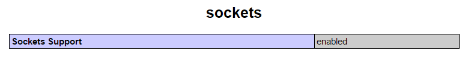

# Apuntes para el servidor

Cosas que voy a ir necesitanto a medida que avance el proyecto, todas o casi todas ablaran sobre PHP, que es el lenguaje elegido para la programación del lado del servidor.

## Pasos que voy ha tener que ir dando

Una maner de saver que dispositovos estan conectados a unuestra en red en linux, es utilizar la aplicación nmap, esta aplicación escanea el rengo de ip que le especifiquemos y nos devuelve información del dispositivo y su IP.

~~~~
  sudo nmap -sP 192.168.43.1-254
~~~~

Hay ha vido que configurar la maquina virtual forme parte de la misma red que el resto de dispositivos, para heso emos hecho una confiracion adaptador puente.

~~~~
  config.vm.network :public_network,:bridge=>"eth0"
~~~~
En estas linea le indicamos que haga una conexión publica y que cre un puente con la targeta de red eth0. De todas maneras con esta cofiguración, aun estando en el mismo rango de IP y poder hacer ping contra la maquina virtual desde cualquier parte de la red, no puede hacer ping desde la maquina virtual a la maquina anfritrion aun estando conectado a la red.

Otro problema que nos podemos encontrar, es que al conectarnos a otra red, esta red trabaje con otro rango de IPs o la IP que tengamos en la maquina virtual ya este asignada, en ese caso podemos utilizar el comando   <code>sudo /etc/init.d/networking</code>   restart para que reinicie la targeta de red y que el ruter le reasigne una direccion IP, no voy a tener este problema a la hora de presentar el proyecto al llevare mi propio ruter configurado con una IP fija, de todas maneras si tengo suficiente timpo intentare suvir el proyecto a un servidor, con una IP fija.

Montar el servidor con Apache, php y mySQL, antes que nada verificamos si php esta preparado para recivir conexiones a traves de un socket, para eso creamos un archivo index.php con el metodo, info(), y buscamos la linea donde nos indica si el tipo de conexión esta avilitada.

Hacemos un archivo de para intentar realizar una conecxión.

Para heso creo un script de php que sera un daemon que correra en segundo plano y se encargara de ir haceptando todas las peticiones que tengamos.

## Instalando Composer Estructura de carpetas

Para una merjor gestión de los archivos utilizar Composer, para eso vamos a la carpeta codigo y creamos el archivo de configuración.

Tanto la Raspberry como el servidor WEB tendran la misma estructura de carpetas.

-   socket
-   WEB
    -   public
        -   js
        -   css
        -   img
-   core
    -   domain
    -   aplication

##Pendiente

##Sockets

Es el tipo de conexión que voy a utilizar para recivir las diferentes peticiones de los clientes.

###Proyectos y ejemplos similares

[Pagina oficial](http://php.net/manual/es/book.sockets.php)
[Pagina de mozilla](https://developer.mozilla.org/es/docs/WebSockets-840092-dup/Escribiendo_servidores_con_WebSocket)
[Ejemplo de concxión](http://www.cristalab.com/tutoriales/crear-un-socket-server-con-php-c97147l/)
[Curso que esplica los sockets](https://www.redeszone.net/curso-php-online-recopilacion-de-articulos/)

## Websockets

En la parte del servidor se programa igula que un socket normal, de todas maneras se le puede hechar un vistazo a la libreria [Ratchet](http://socketo.me/), que promete el manejo de las conexiones de este tipo.

###Proyectos y ejemplos similares

[Ejemplo y esplicación muy buenas](http://developer.firefoxmania.uci.cu/2014/05/01/websockets-en-la-practica-2/)
[Pequeño ejemplo](http://www.kabytes.com/programacion/websockets-para-php/)

## Servidor

La idea era montar dos servidores, uno que se encargse puramente de la logica y otro que se encarge de servir al cliente web, pero he pensado que eso haria una separación demasiado clara y no se entenderia del todo bien la arquitectura hexagonal.

Por lo tanto se montara un unico servidor para todo, lo unico que igual si lo ago para el desarroyo del proyecto, una separación tan clara me puede ayudar a depurar responsabilidades.

###Proyectos y ejemplos similares

##Configuración Vagrant
Vagrant es el asistente para montar maquinas virtules que voy ha utlizar.

###Proyectos y ejemplos similares

[Pequeño manual de configuración de vagrant](http://www.conasa.es/blog/vagrant-configuracion-basica-de-la-maquina-virtual/)
[Otro manual mas](https://www.adictosaltrabajo.com/tutoriales/vagrant-install/#5.%20Como%20instalo%20software%20de%20forma%20que%20lo%20vean%20mis%20compa%C3%B1eros?)

### Material suelto
#### Problema de crear una red Vagrant
[Enlace](http://serviciosgs.readthedocs.io/es/latest/introduccion/vagrant.html)
~~~
config.vm.network :public_network,:bridge=>"eth0"
~~~

[Fuente](https://www.enmimaquinafunciona.com/pregunta/9283/vagrant-ip-publica-no-es-accesible)
~~~
config.vm.network "public_network", ip: "192.168.56.101", :mac => "0022334455DA"
config.vm.network :public_network, ip: '172.16.35.51', :netmask => '255.255.0.0', :bridge => 'eth0'
~~~

[Fuente](https://media.readthedocs.org/pdf/serviciosgs/latest/serviciosgs.pdf)
~~~
nodo2.vm.network :public_network,:bridge=>"eth0"
nodo2.vm.network :private_network, ip: "10.1.1.102"
config.vm.network :public_network, ip: '172.16.35.51', :netmask => '255.255.0.0', :bridge => 'eth0'
~~~

[Fuente](https://styde.net/compartir-virtualhost-en-red-local-lan-vagrant-homestead/)
~~~
config.vm.network :private_network, ip: settings["ip"] ||= "192.168.10.10"
config.vm.network :public_network, :adapter=>3, ip: "192.168.1.200"
~~~

## PHP

[php IteratorAggregate](http://php.net/manual/es/language.oop5.iterations.php) la esplicación esta casi al final.
`if(array_key_exists($ticker, $contenido))` `$contenido` es un array y `$ticker` es la clave del elemento que buscamos.

### Apuntes varios
[Pagina muy buena que explica la configuarción de la tarjeta de red en VirtualBox](http://fpg.x10host.com/VirtualBox/modo_adaptador_puente.html)
[Tutorial bastane bueno de Vagran](https://www.adictosaltrabajo.com/tutoriales/vagrant-install/)
